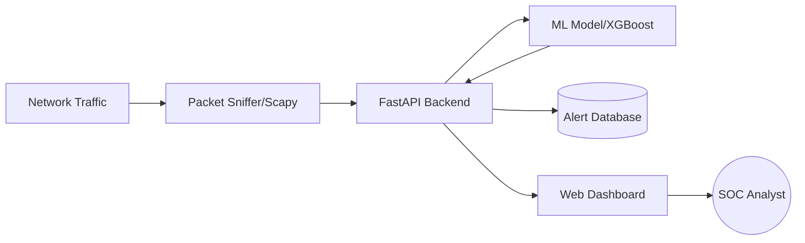
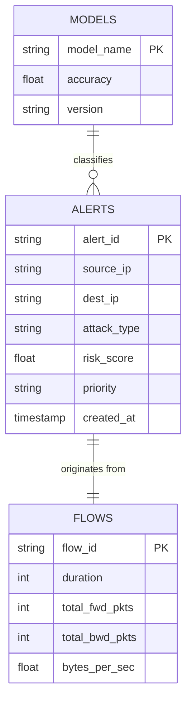

# Project Synopsis: AI-Driven SOC Alert Prioritization System

## 1. Title Page
**Project Title:** Intelligent SOC: AI-Driven Network Traffic Monitoring & Alert Prioritization  
**Domain:** Cyber Security & Machine Learning  
**Tools:** Python, Scapy, FastAPI, XGBoost, React  

---

## 2. Abstract
Modern Security Operations Centers (SOCs) are overwhelmed by "alert fatigue"—the sheer volume of security alerts generated by traditional Intrusion Detection Systems (IDS). This project implements an intelligent SOC system that captures real-time network traffic, processes it into structured network flows, and uses advanced Machine Learning (ML) models (XGBoost and Random Forest) to classify and prioritize threats. The system aims to automate the triage process, allowing security analysts to focus on high-risk incidents, thereby reducing response time and operational overhead.

---

## 3. Introduction
The increasing complexity of cyber-attacks requires rapid detection and response. Existing SOC tools often lack the context to distinguish between benign anomalies and critical threats. This project addresses this gap by:
1.  **Automated Feature Extraction:** Converting raw packet data into flows using Scapy.
2.  **ML Integration:** Using the CIC-IDS 2017 dataset for robust training.
3.  **Real-Time Monitoring:** Providing a live dashboard for traffic analysis and alert visualization.
4.  **Priority Scoring:** Assigning risk levels (Critical, High, Medium, Low) to each detected event.

---

## 4. Hardware & Software Requirements

### Hardware Requirements:
- **Processor:** Intel Core i5 or higher (minimum 4 cores).
- **RAM:** 8 GB DDR4 (16 GB recommended for high-traffic environments).
- **Storage:** 50 GB available SSD space.
- **Network:** Gigabit Ethernet Card (NIC) with monitor mode support.

### Software Requirements:
- **Operating System:** Windows 10/11 or Ubuntu 20.04+.
- **Language:** Python 3.10+.
- **Backend Framework:** FastAPI.
- **ML Libraries:** XGBoost, Scikit-learn, Pandas, NumPy.
- **Packet Capture:** Scapy.
- **Frontend:** React with CSS modules or Tailwind.
- **Server:** Uvicorn.

---

## 5. Resources & Methodology

### Methodology:
The system follows a 4-stage pipeline:
1.  **Data Acquisition:** The `SnifferManager` uses Scapy to capture packets on the local network interface.
2.  **Flow Generation:** Packets are grouped by 5-tuple (Src IP, Dst IP, Src Port, Dst Port, Protocol). Features like Flow Duration, Packet Lengths, and TCP flags are aggregated.
3.  **Preprocessing & Classification:** Features are scaled (StandardScaler) and fed into the XGBoost/RF model. The model predicts the attack type (e.g., DoS, PortScan, Botnet).
4.  **Priority Engine:** Based on the attack type and confidence score, the system calculates a risk score and assigns a priority level.

### Algorithm Explanation:
-   **XGBoost:** A gradient-boosted decision tree library designed for speed and performance. It minimizes a regularized objective function to prevent overfitting while handling large-scale tabular data efficiently.
-   **Random Forest:** An ensemble method that constructs multiple decision trees and merges them to get a more accurate and stable prediction. It is resistant to noise and works well with high-dimensional data.

---

## 6. DFD and ER Diagrams

### Data Flow Diagram (DFD Level 1)

### Entity Relationship (ER) Diagram

---

## 7. Conclusion
The Intelligent SOC system successfully demonstrates the application of Machine Learning in cyber security operations. By automating the classification of network flows and prioritizing alerts, the system significantly mitigates the risk of missing critical threats due to analyst overload. The integration of real-time sniffing and a modern web interface makes it a practical tool for proactive network defense.

---

## 8. Future Enhancements
-   **Anomaly Detection:** Integration of unsupervised learning (Isolation Forest) for Zero-day threat detection.
-   **Automated Response:** Implementing an "Auto-Block" feature with Firewall/IPS integration.
-   **Cloud Integration:** Support for VPC flow logs from AWS/Azure for hybrid environment monitoring.
-   **Model Retraining:** Auto-tuning the models as new traffic patterns emerge.

---
**Font Recommendation:** For the final document, please apply **Times New Roman**, size 12, with 1.5 line spacing.
